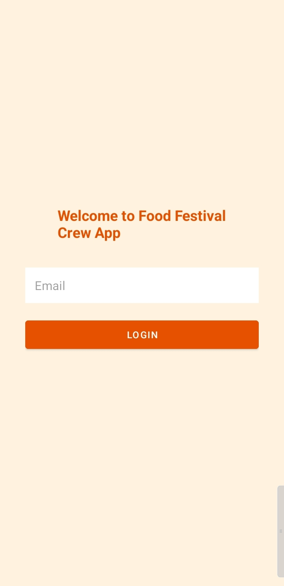
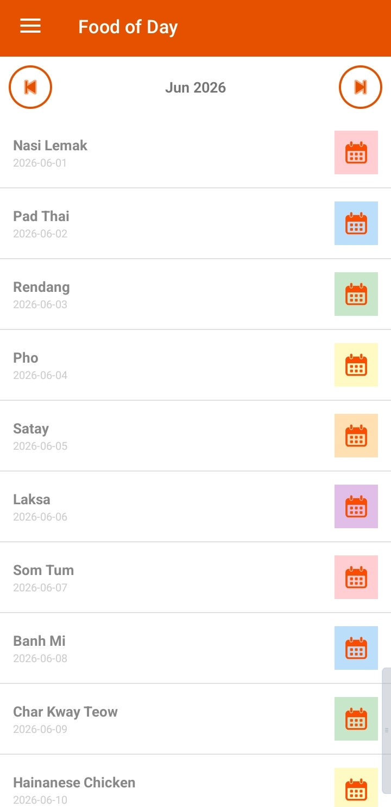
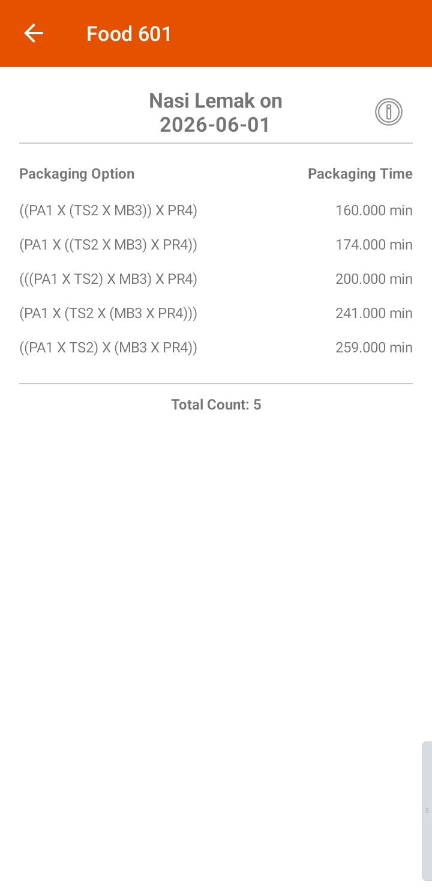
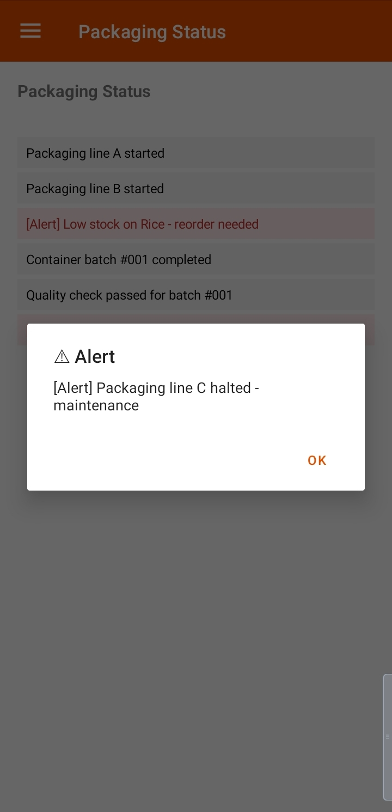
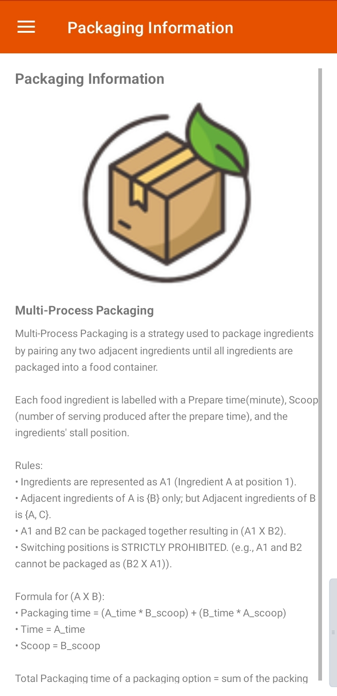

<div>
  
# Food Festival Crew API
*A Food Festival held in Manila, Philippines. This application follows software industry standard using microservices architecture. The CrewAPI is the middleware API between FoodFestivalAPI and mobile client.*

</div>

---

## 🍊 Screenshots

<div align="center">
<table border="0" style="border: none; border-collapse: collapse;">
  <tr>
    <td align="center" style="border: none; padding: 8px;">
      
      <br/>
      <sub>🔐 Login Screen</sub>
    </td>
    <td align="center" style="border: none; padding: 8px;">
      
      <br/>
      <sub>🍽️ Food of the Day</sub>
    </td>
    <td align="center" style="border: none; padding: 8px;">
      
      <br/>
      <sub>📋 Food Details</sub>
    </td>
    <td align="center" style="border: none; padding: 8px;">
      
      <br/>
      <sub>🔔 Packaging Status</sub>
    </td>
    <td align="center" style="border: none; padding: 8px;">
      
      <br/>
      <sub>📦 Multi-Process Packaging</sub>
    </td>
  </tr>
</table>
</div>

---

## 🛠️ Tech Stack

<div>


</div>

---

## ⚙️ Key Features

**🔐 Authorized Access Only**
> Only registered API users with valid credentials can log in and access the application.

**🍽️ Food of the Day**
> Displays the current featured food fetched live from the FoodFestivalAPI middleware.

**📋 Ingredient Details & Formula**
> Shows food ingredient breakdown with packaging time computed using: `packaging_time = (Atime × Bscoop) + (Btime × Ascoop)`

**🔔 Packaging Status Alerts**
> Real-time packaging process status pulled directly from the FoodFestivalAPI.

**📦 Multi-Process Packaging Guide**
> In-app explanation page to help crew members understand and follow the multi-process packaging workflow.

---

## 🚀 How to Run

**1. Activate the CrewAPI microservice**
> Navigate to: `FoodFestivalCrew → app → src → main → microservice → crew_api`
```
node server.js
```

**2. Activate the mock FoodFestivalAPI microservice**
> Navigate to: `FoodFestivalCrew → app → src → main → microservice → mock_festival_api`
```
node festivalServer.js
```

**3. Open Android Studio**
> Navigate to `RetrofitClient.java` and update the `BASE_URL` to your machine's IP address.

**4. Check your IP address**
```
ipconfig
```
> Copy the **IPv4 Address** and paste it as the `BASE_URL` value in `RetrofitClient.java`.

**5. Clone and open the repository in Android Studio**
> Paste the repository link when prompted to open a project.

**6. Run the app**
> Use the built-in emulator, or connect your phone via data cable and run directly on device.

**7. Enjoy! 🎉**

---

## 🔑 Valid Logins

| Email | Access |
|---|---|
| `admin@food.my` | Always Authorized |
| `alice@food.my` | Crew |
| `bob@crew.my` | Crew |
| `chef.maria@food.my` | Crew |
| `supervisor@festival.my` | Crew |
| `crew1@food.my` | Crew |

<div align="center">

</div>
